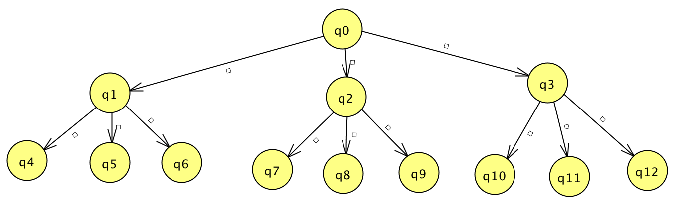

# Assignment 1 - Abhay Varshney
**Date: October 3rd, 2018
Section: #74604, W 5:15-8pm**

## The Basic Programming Task

This shell script runs in a while loop infinitely. During this, it read an input command from terminal. If the words **"exit"** is inputted by the user, the program will exit. If the user types something else and clicks enter, then a **helloworld.c** program will be launched which would simply output ***"Hello World"*** and continue with the program. In order to exit the program, if the input reads "exit", I call the command: `exit(0);` If the user inputs something else, I call the function `fork()` which would create a new child process. If it is successful, then we will call the helloworld program by calling the command `execve(input, NULL, NULL);`, in which the input would equal to the user strin ginput (helloworld), and then the program would continue to run. 

I tested this by first checking if I could exit the program correctly. Once that worked, I tried running the program by calling the helloworld program. After, I chose to type a random string, and the program properly alerted me that the file doesn't exist in the current directory.

## The Second Programming Task

For this task, I created a child process under the current process 8 times using a for loop. Each parent process would have only 1 process. When I call the function `fork()`, a new child process should be created. If the output of the fork call isn't 0, then we should wait for the process to change state and then exit the program by calling `exit(0)`. If the process is 0, then we want to print out the **parent** and **child process ID** and continue with the program. 

I tested this program by running the program just to see if it works with 8 processes. Then, I changed the number of expected processes to 5 to see if only 5 child processes were created.

## The Third Programming Task - 12 processes

For this task, I created a total of 12 child processes. In order to do this, I needed to create 3 child processes for every parent. By doing this, till level 3, I would have a total of 12 child processes (look at image below for how the child process tree would look like). So, in the code, I should have a `for` loop that would make 3 processes for the current process. There should be a level counter that would indicate what current level the program is. Once the level reaches to 4, we would call `exit(0)`, which would exit the program.

I tested this program by running the program and outputting which the child process id and its parents. I verified that for each child process id, there would be a previously created parent process id. Also, in the output, I verified that there was 3 child processes created for each parent process.

 ## The Fourth Programming Task - 17 processes
 
 For this task, I created a total of 17 child processes. In order to do this, I needed to create 2 child processes for every parent - except for level 2/index 1. This is because in order to get 17 processes, there needs to be an extra child on the left side of the tree (look at image below for more information). By doing this, till level 3, I would have a total of 17 child processes (look at image below for how the child process tree would look like). So, in the code, I should have a `for` loop that would make 1 processes for the current process. There should be a level counter that would indicate what current level the program is. If the level variable ever equals 2 and the current index within the for loop is equal to 0, we know that we want to create 3 child processes for the current process, thus we set the variable `processes` to `0`. Once the level reaches to 4, we would call `exit(0)`, which would exit the program.
 
 I tested this program by running it and verifying the child process id. I referenced each child process id to the parent process id and made sure that there should be at least 2 child processes with the same parent process. Also, I wanted to make sure that a minimum of 3 child processes had the same parent process.!
 